# 🚗⚡ T-Buddy

<div align="center">


**A modern, native iOS companion app for TeslaMate**

[Join TestFlight Beta](#-join-testflight-beta) • [Report Bug](../../issues) • [Request Feature](../../issues)

</div>

---

## 📖 Table of Contents

- [About](#-about)
- [Features](#-features)
- [Requirements](#-requirements)
- [Installation](#-installation)
- [Screenshots](#-screenshots)
- [Getting Started](#-getting-started)
- [Support](#-support)
- [Privacy](#-privacy)
- [Acknowledgments](#-acknowledgments)

---

## 🎯 About

**T-Buddy** is a beautiful, modern iOS application designed to bring your TeslaMate data to your iPhone. Built with SwiftUI and leveraging the latest iOS technologies, T-Buddy provides a seamless, native experience for monitoring your Tesla vehicle's telemetry, charges, drives, and more—all from your pocket.


## 💝 A Labor of Love

T-Buddy is a passion project created for the love of technology and the Tesla community. This app is **not monetized**—there are no ads, no subscriptions, and no in-app purchases. 

My goal is simply to share this tool with fellow Tesla and TeslaMate enthusiasts, hoping it will be as useful to you as it has been to me. If you find value in T-Buddy, consider starring this repo and sharing it with others who might benefit from it.

This is my way of giving back to the amazing open-source community that makes projects like TeslaMate possible. 🚗⚡

### Who is this for?

T-Buddy is perfect for:

- **Tesla owners** who already run [TeslaMate](https://github.com/teslamate-org/teslamate) to log their vehicle data
- **Tech enthusiasts** who want native iOS access to their vehicle telemetry
- **Data-driven users** who appreciate detailed insights about their charging sessions, drives, and vehicle health
- **Privacy-conscious individuals** who prefer self-hosted solutions over cloud-based services

---

## ✨ Features

### 🚀 Core Features

- **Live Dashboard**: Real-time vehicle status including battery level, charging state, location, and more
- **Charge History**: Detailed charge session logs with cost, energy added, and efficiency metrics
- **Drive History**: Comprehensive trip logs with distance, duration, consumption, and route details
- **Battery Health**: Track degradation, charge cycles, and battery performance over time
- **Vehicle Stats**: Odometer, total charges, total drives, and software updates
- **Multiple Vehicles**: Support for monitoring multiple Tesla vehicles
- **Dark & Light Mode**: Beautiful adaptive UI that respects your system preferences

### 🎨 UI/UX Highlights

- **Native SwiftUI**: Built from the ground up with SwiftUI for iOS 26+
- **Modern Design**: Clean, intuitive interface with smooth navigation
- **Accessibility**: Full VoiceOver support, Dynamic Type, and WCAG AA compliance
- **Smooth Animations**: Delightful, subtle animations throughout the app
- **Haptic Feedback**: Tactile responses for key interactions

### 🔐 Privacy & Security

- **No Tesla Token Access**: T-Buddy never accesses, stores, or retrieves your Tesla account tokens stored in TeslaMate. The app only reads aggregated vehicle data through the TeslaMate API
- **Keychain Storage**: API credentials and passwords securely stored in iOS Keychain
- **Local First**: All data cached locally using SwiftData
- **No Analytics**: Zero telemetry sent to third parties
- **Self-Hosted**: Your data stays on your infrastructure

### 📱 Additional Features

- **Widgets**: Home screen and Lock screen widgets for quick vehicle status
- **Live Activities**: Real-time charging updates on Dynamic Island
- **Background Refresh**: Automatic updates even when the app is closed
- **Push Notifications**: Alerts for charging completion, software updates, and TPMS warnings
- **Quick Actions**: 3D Touch shortcuts for instant access to key features
- **Localization**: Available in English and Spanish. Want T-Buddy in your language? [Open an issue](../../issues) with your request!

---

## 📋 Requirements

To use T-Buddy, you need:

### Essential Requirements

1. **TeslaMate Instance** (v1.28.0 or later)
   - A self-hosted TeslaMate installation logging your Tesla vehicle data
   - [TeslaMate GitHub Repository](https://github.com/teslamate-org/teslamate)
   - [TeslaMate Documentation](https://docs.teslamate.org/)

2. **TeslaMate API** (v2.0.0 or later)
   - A REST API layer for TeslaMate to expose data to mobile apps
   - [TeslaMate API GitHub Repository](https://github.com/tobiasehlert/teslamateapi)
   - Required for T-Buddy to communicate with your TeslaMate database

3. **Network Access**
   - Your iPhone must be able to reach your TeslaMate API server
   - Options include:
     - **Same local network** (easiest for home WiFi)
     - **VPN connection** (e.g., WireGuard, Tailscale) for remote access
     - **Public exposure** with proper authentication (not recommended without security measures)

### iOS Requirements

- **iOS 26.0 or later**
- **iPhone** (optimized for all screen sizes from iPhone SE to iPhone 16 Pro Max)
- **Internet connection** (WiFi or Cellular to reach your TeslaMate API)

### TeslaMate API Configuration

Your TeslaMate API must be configured with:

- **Base URL**: The URL where your TeslaMate API is accessible (e.g., `https://teslamateapi.yourdomain.com`)
- **Authentication**: Bearer token or Basic Auth (strongly recommended)
- **TLS/SSL**: HTTPS enabled for secure communication (port 8883 default)

> **Note**: T-Buddy does NOT work with Tesla's official API directly. It requires TeslaMate to be logging your vehicle data first.

---

## 📥 Installation

### 🧪 Join TestFlight Beta

T-Buddy is currently in beta testing. To try the app:

1. **Join the TestFlight Beta**:
   - [Click here to join TestFlight Beta](https://testflight.apple.com/join/uYQ85MZu)
   - Or scan this QR code with your iPhone Camera:


   

2. **Install TestFlight** (if you don't have it):
   - Download [TestFlight from the App Store](https://apps.apple.com/app/testflight/id899247664)

3. **Install T-Buddy**:
   - Open the TestFlight invitation link on your iPhone
   - Tap "Accept" and then "Install"

---

## 🚀 Getting Started

### Quick Start Guide

1. **Ensure TeslaMate is running**:
   ```bash
   # Check TeslaMate is accessible
   curl http://your-teslamate-host:4000
   ```

2. **Verify TeslaMate API is running**:
   ```bash
   # Check TeslaMate API health
   curl http://your-teslamateapi-host:8080/api/v1/cars
   ```

3. **Open T-Buddy** and follow the onboarding flow

4. **Configure your connection**:
   - Go to **Settings** → **API Configuration**
   - Enter your API details
   - Test the connection

5. **Start monitoring!** Your dashboard will populate with real-time vehicle data


### 🛠️ First-Time Setup

After installing the app:

1. **Launch T-Buddy** on your iPhone
2. **Complete onboarding**:
   - Confirm you have TeslaMate installed and running
   - Confirm you have TeslaMate API installed and accessible
3. **Configure API Connection**:
   - Enter your TeslaMate API base URL (e.g., `https://api.teslamate.home:8443`)
   - Choose authentication method (Token recommended)
   - Enter your API token or username/password
   - Tap "Test Connection" to verify
4. **Grant Permissions** (optional but recommended):
   - **Notifications**: For charge completion, software updates, and TPMS alerts
   - **Background App Refresh**: For automatic data updates

---

## 📸 Screenshots

### 🏠 Dashboard & Vehicle Status

<div align="center">
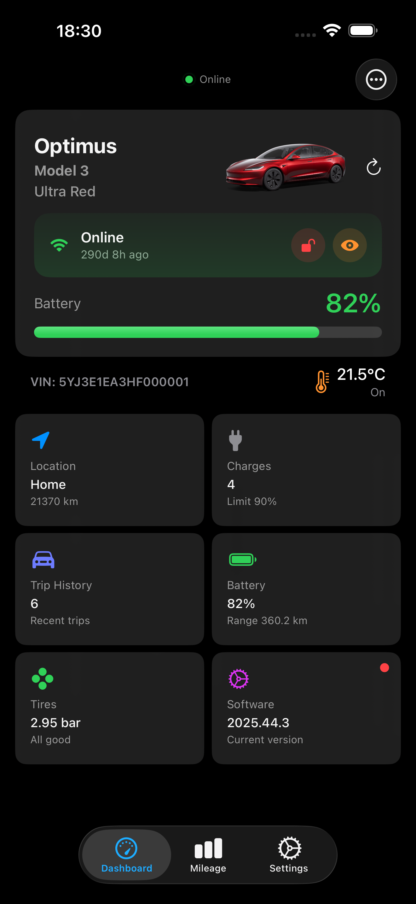
</div>

### 🔋 Battery Health & Details

<div align="center">
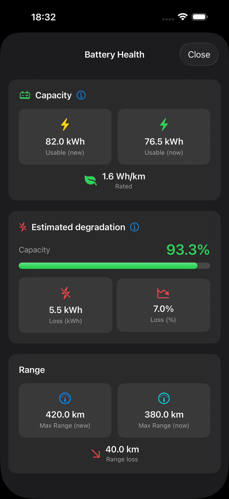
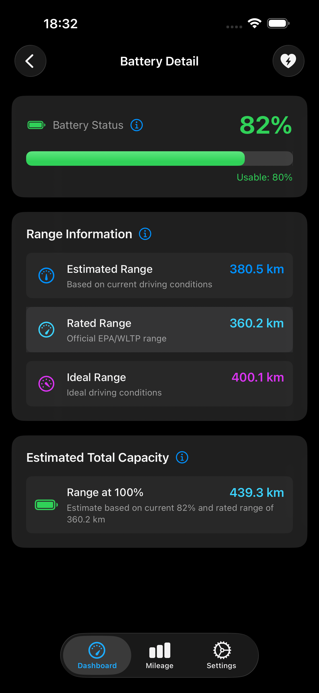
</div>

### ⚡ Charge History

<div align="center">
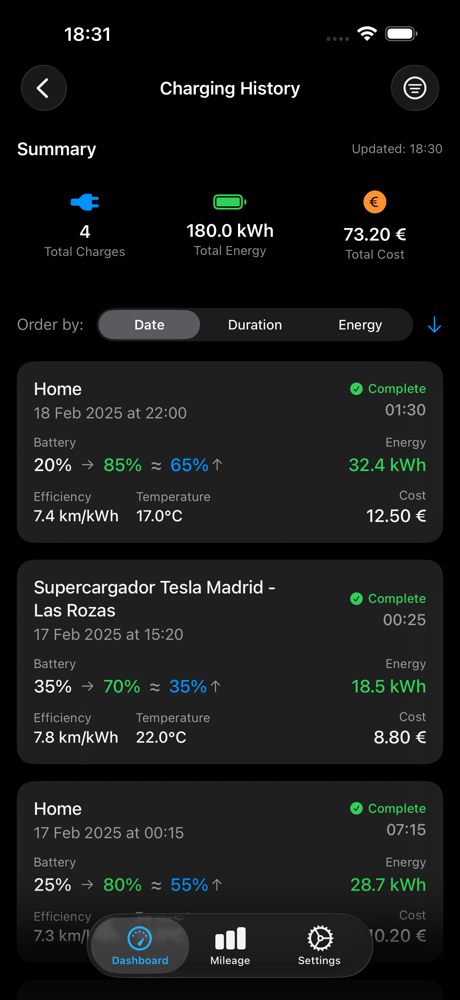

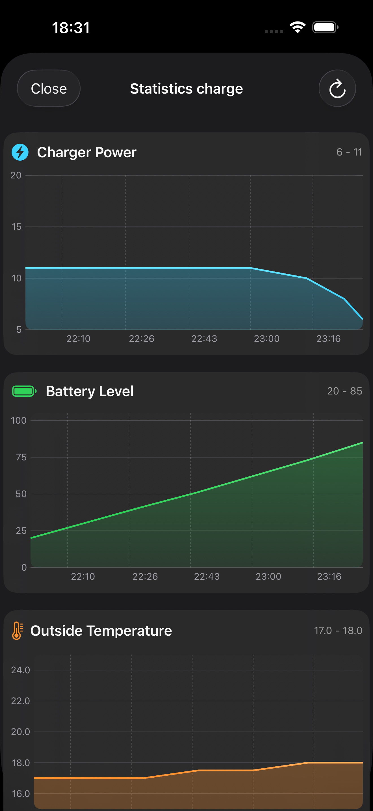
</div>

### 🚗 Drive History

<div align="center">
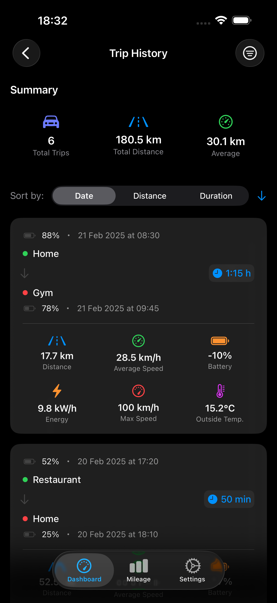
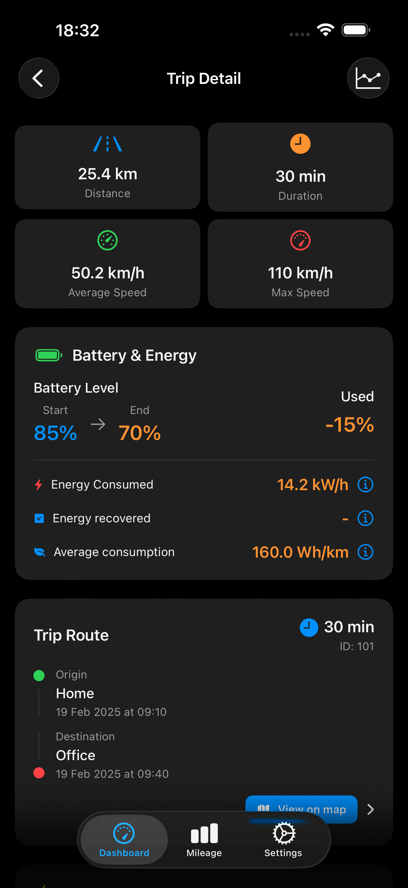
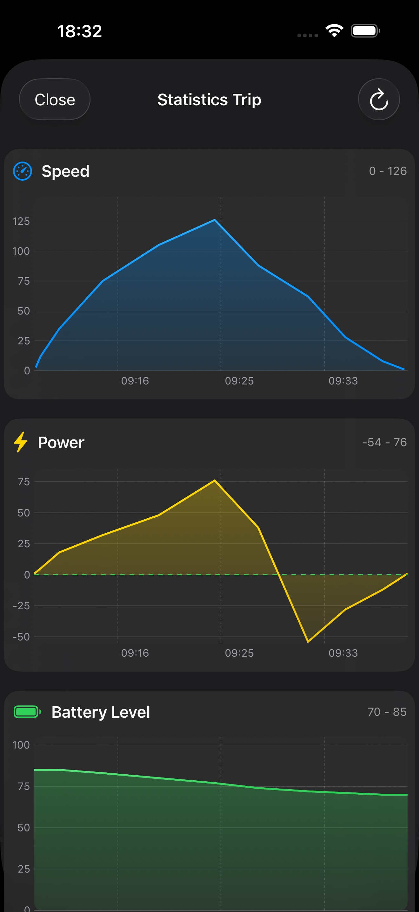
</div>

### 📊 Mileage Tracking

<div align="center">
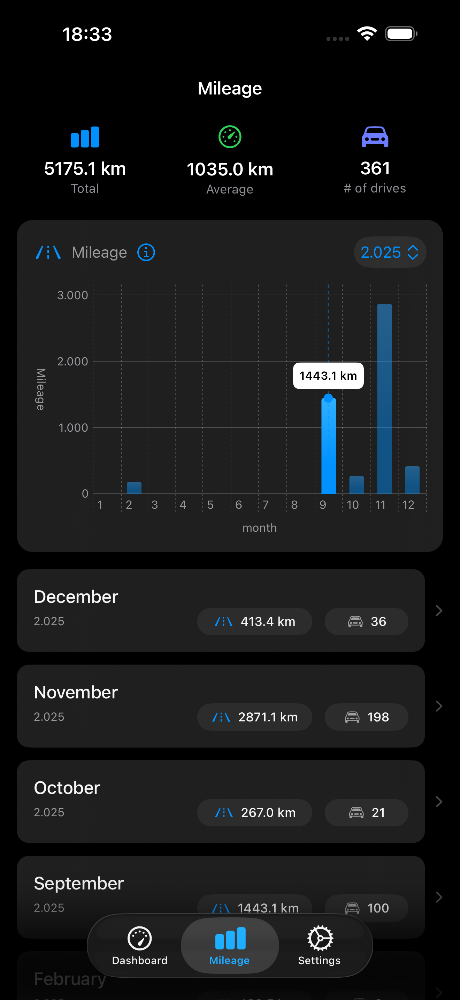
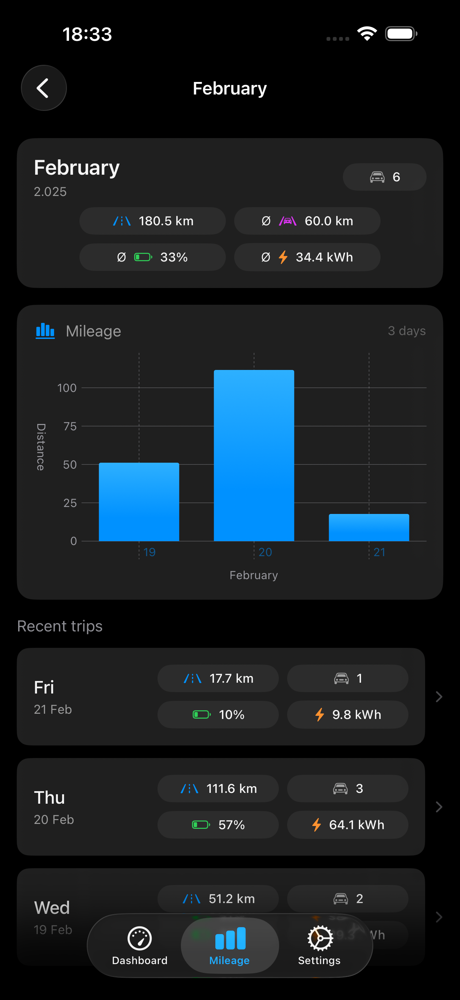
</div>

### 📱 Widgets & Live Activities

<div align="center">
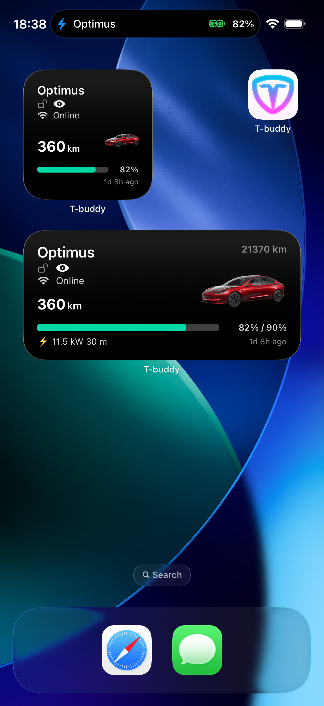
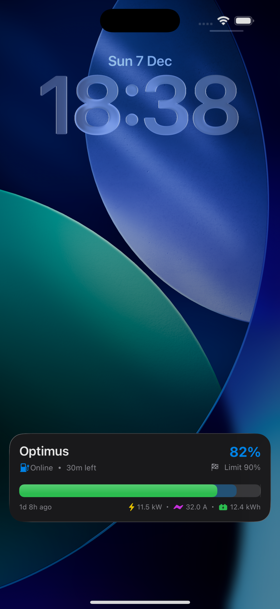
</div>


### Troubleshooting Connection Issues

If T-Buddy cannot connect to your TeslaMate API:

- **Check network connectivity**: Ensure your iPhone can reach the API URL (try opening it in Safari)
- **Verify API is running**: Check TeslaMate API logs for errors
- **Check authentication**: Ensure your token or credentials are correct
- **Check SSL certificate**: If using self-signed certificates, you may need to disable SSL verification (not recommended for production)
- **Check firewall rules**: Ensure port 8080 (or your custom port) is open
- **Try local IP first**: Test with your server's local IP address (e.g., `http://192.168.1.100:8080`) before using domain names

Still having trouble? [Open an issue](../../issues) with details about your setup.

---

## 💬 Support

### Reporting Issues

Found a bug or experiencing unexpected behavior? Please help us improve T-Buddy:

1. **Check existing issues**: See if someone has already reported it in [Issues](../../issues)
2. **Open a new issue**: [Create a new issue](../../issues/new) with:
   - **Clear title**: Brief description of the problem
   - **Steps to reproduce**: How to trigger the bug
   - **Expected behavior**: What should happen
   - **Actual behavior**: What actually happens
   - **Environment**:
     - T-Buddy version (visible in Settings → About)
     - iOS version
     - iPhone model
     - TeslaMate version
     - TeslaMate API version
   - **Screenshots/Logs**: If applicable (remove any sensitive data!)

### Feature Requests

Have an idea to make T-Buddy better?

1. **Check existing requests**: See if it's already suggested in [Issues](../../issues?q=is%3Aissue+label%3Aenhancement)
2. **Open a feature request**: [Create a new issue](../../issues/new) with:
   - **Clear description**: What feature you'd like to see
   - **Use case**: Why this feature would be valuable
   - **Mockups/Examples**: Visual examples if applicable

### Community

- **Discussions**: General questions, ideas, and community chat → [Discussions](../../discussions) (if enabled)
- **Updates**: Follow releases and changelogs → [Releases](../../releases)

> **Note**: This is an independent community project. Response times may vary as this is maintained by volunteers.

---

## 🔒 Privacy

T-Buddy takes your privacy seriously:

- **No data collection**: T-Buddy does not collect, store, or transmit any of your data to third-party services
- **No analytics**: Zero telemetry or crash reporting to external servers
- **Local storage**: All data is cached locally on your device using SwiftData
- **Self-hosted infrastructure**: Your TeslaMate data stays on your own infrastructure
- **Secure credentials**: Passwords and tokens are stored in iOS Keychain, never in plain text
- **Open development**: Development practices documented in this public repository (code not included)

### Permissions Explained

T-Buddy requests the following permissions:

- **Network Access**: To communicate with your TeslaMate API (required)
- **Background App Refresh**: To update data automatically in the background (optional)
- **Notifications**: To alert you about charge completion, updates, and warnings (optional)

All permissions are opt-in and explained during setup.

---

## 🙏 Acknowledgments

T-Buddy would not be possible without these amazing open-source projects:

- **[TeslaMate](https://github.com/teslamate-org/teslamate)** - The incredible self-hosted Tesla data logger by Adrian Kumpf and contributors
- **[TeslaMate API](https://github.com/tobiasehlert/teslamateapi)** - REST API layer for TeslaMate by Tobias Ehlert
- **[SwiftUI](https://developer.apple.com/xcode/swiftui/)** - Apple's modern UI framework

Special thanks to:

- The TeslaMate community for building such a robust logging platform
- All beta testers providing valuable feedback
- Tesla owners who share the passion for data and EVs

---

## 📄 License

T-Buddy is proprietary software. The source code is not publicly available.

This repository is for **community engagement only**:
- Report bugs and issues
- Request features
- Discuss ideas
- Receive updates and announcements

**Copyright © 2025 Giovanny Aranda. All rights reserved.**

---

## 🛣️ Roadmap

Planned features for future releases:

- [ ] Apple Watch companion app
- [ ] iPad optimization with multi-column layouts
- [ ] Shortcuts integration for Siri commands
- [ ] CarPlay support for in-vehicle access (Or maybe not...)
- [ ] Charge cost calculator and trends
- [ ] Export data (CSV, JSON)
- [ ] Advanced filtering and search
- [ ] More widget styles and sizes

Have suggestions? [Let us know!](../../issues)

---

## 📞 Contact

- **Issues & Bugs**: [GitHub Issues](../../issues)
- **Feature Requests**: [GitHub Issues](../../issues/new?labels=enhancement)

---

<div align="center">

**Made with ❤️ for the Tesla and TeslaMate community**

⭐ Star this repo to show your support!

[Back to Top](#-t-buddy)

</div>
